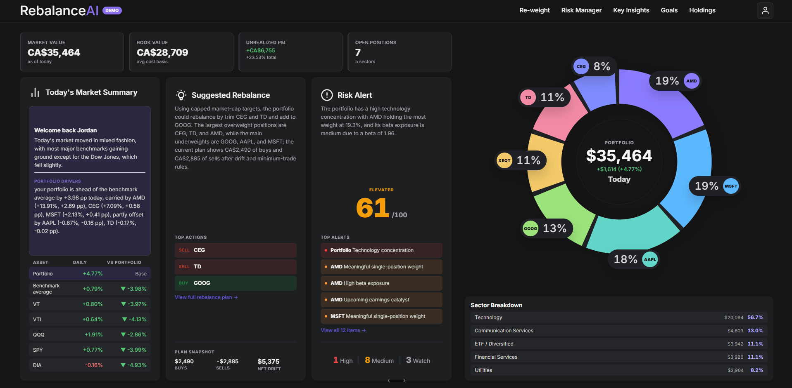

# RebalanceAI

AI-powered portfolio intelligence platform for portfolio tracking, rebalancing, risk management, and long-term goal planning.

RebalanceAI transforms brokerage CSV exports into a modern portfolio command center. Import holdings, track live performance, analyze concentration risk, generate intelligent rebalance plans, monitor catalysts, and model FIRE / wealth-building goals — all through a polished full-stack dashboard.

---

## Why RebalanceAI?

Most retail investing tools show balances. RebalanceAI helps answer:

- **Am I too concentrated?**
- **What should I buy or trim right now?**
- **How risky is my current allocation?**
- **How am I performing vs the market?**
- **Am I on track for my FIRE / wealth goals?**

It combines portfolio analytics with explainable decision tools in a clean fintech-style interface.

---

## Core Features

## Dashboard

Your portfolio control center.

- Total market value, book value, unrealized P&L
- Daily portfolio return vs benchmark average
- Sector allocation donut chart
- Market summary with benchmark comparisons
- Suggested rebalance summary
- Risk alert score with flagged concerns
- Top actions and portfolio drift snapshot

---

## Holdings

Import and manage positions.

- CSV import from broker exports
- Searchable holdings table
- Multi-currency support (USD/CAD)
- Live prices and unrealized gains/losses
- Daily change tracking
- Backend persistence
- Demo mode sample portfolio

---

## Re-weight

Generate optimized rebalance plans.

Supports multiple strategies:

- **Capped Market Cap**
- **Pure Market Cap**
- **Square Root Market Cap**
- **Equal Weight**
- **Manual Targets**

Includes:

- Drift threshold logic
- Fractional shares
- Minimum trade filters
- Cash-first mode
- No-sell mode
- Max single-position caps
- Explainable trade rationale

---

## Risk Manager

Scan current holdings for portfolio weaknesses.

Checks include:

- Sector concentration
- Single-position concentration
- High beta exposure
- Small / micro cap sizing risk
- Earnings catalysts
- News / headline concerns
- Missing market cap / data quality issues
- Diversification gaps

Severity ranked into:

- High
- Medium
- Watch

---

## Key Insights

AI-assisted portfolio pattern recognition.

Examples:

- Strongest winners
- Largest laggards
- Concentration observations
- Sector sleeve dominance
- Core ETF diversification benefits
- Research ideas
- Broad diversification checks

---

## Goal Planner

Project future wealth outcomes.

Includes:

- Lean FIRE / Regular FIRE / Fat FIRE presets
- Adjustable age targets
- Monthly contribution sliders
- Bull / Base / Bear scenarios
- Inflation-adjusted targets
- Confidence score indicators
- Suggested monthly contribution increases

---

## Demo Mode

Built-in sample portfolio for instant product exploration.

- Toggleable from settings
- Loads backend demo holdings
- Great for showcasing features without importing data

---

## Tech Stack

| Layer         | Technology                 |
| ------------- | -------------------------- |
| Frontend      | React 19, TypeScript, Vite |
| Routing       | React Router 7             |
| Backend       | Python, FastAPI            |
| Market Data   | yfinance                   |
| Charts        | Recharts                   |
| Styling       | Custom CSS                 |
| AI (optional) | Ollama (llama3.x)          |

---

## Architecture Highlights

- Full-stack React + FastAPI application
- Modular page-based frontend
- JSON-backed local persistence layer
- Multi-currency portfolio normalization
- Explainable portfolio decision engine
- Live + fallback pricing system
- Responsive dark-mode product UI

---

## Rebalancing Engine

The optimizer evaluates holdings and recommends trades using configurable rules.

### Supported Constraints

- Max stock %
- Drift threshold %
- Minimum trade amount
- Available cash
- Fractional share support
- No-sell mode
- ETF preservation logic

### Example Output

- Sell overweight positions
- Buy underweight positions
- Net drift reduced
- Position caps respected

---

## Risk Engine Logic

Portfolio concerns are dynamically scored using weighting thresholds.

Examples:

| Check                | Example Trigger             |
| -------------------- | --------------------------- |
| Sector Risk          | Tech > target concentration |
| Position Risk        | Single holding oversized    |
| Volatility Risk      | High beta stock overweight  |
| Catalyst Risk        | Earnings within 21 days     |
| Data Risk            | Missing market cap          |
| Diversification Risk | Overreliance on few names   |

---

## Benchmarks Used

Daily portfolio performance compares against:

- VT
- VTI
- QQQ
- SPY
- DIA

---
